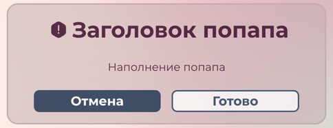

# Documentation for ESC-UI

## 1. Basic Input

### Component: ESC-basic-input.vue

### Description:
- Custom HTML input
- Ability to add an icon
- Useful and comfortable UX/UI
- Password and common text variants of work

### Props:

- **placeholder**: property for input placeholder. Input here the text which you want to see while the input field is empty
- **type**: property for definition input type. Enter here "text", if you want to see the text which you're writing, enter "password", if you want to secure your data. Password mode turns on text hiding.   
- **modelValue**: property for your variable, which you want to change. Define new variable in your class after that enter its name to this property. When you start typing some text in input which you linked with this variable, last one starts changing. Be careful! Variable changes every time when you add new symbols to the input.  
- **hasIcon**: boolean property which define has input an icon or not. If you doesn't add icons to the input you shouldn't define this props. If you want to add an icon just set the property parameter to "true".
- **icon**: (only if "**hasIcon**" is true) property for definition icon source. Enter here the name of your icon **(don't enter an extension!)** which located in the path "assets/icons". Be careful! At the moment we support only **.svg** type of icons.

## 2. Modal popups

### Components: InformationPopup.vue, WarningPopup.vue, ErrorPopup.vue

## Description:
- Popups created for fast informing user about some events. For choose you have 3 variants of popups: Information popup, Warning popup and Error popup.
- **Information popup** needed for delivering information to user, for ex. it can be basic notifications about successful operation.
- **Warning popup** needed for confirmation of some actions, for ex. it can be deletion note or account. Only this variant of popup has 2 buttons, "Cancel" and "OK" for ex.
- **Error popup** needed for warning user about error of application. It will be used like basic error handler.

## Props (slots): 
In popups we use vue-slots for filling popup header, content and buttons. 

- **header**: slot with this name needed for filling popup header (main theme of popup).
- **content**: this slot needs for filling popup content (for ex. popup message or error description).
- **ok_button**: this slot needs for filling the name with the main popup button.
- **cancel_button (only Warning popup)**: this slot also needed for filling the name with the secondary popup button

## Emits
All popups has custom emits: the events, which are creating when user push one of popup buttons

- **@ok**: emit, which creating, when user press "OK" button
- **cancel**: emit, which creating, when user press "Cancel" button

## Examples

Example how to create new popup (using the example Warning popup):

    <WarningPopup>
        <template v-slot:header>Заголовок попапа</template>
        <template v-slot:content>Наполнение попапа</template>
        <template v-slot:cancel_button>Отмена</template>
        <template v-slot:ok_button>Готово</template>
    </WarningPopup>

